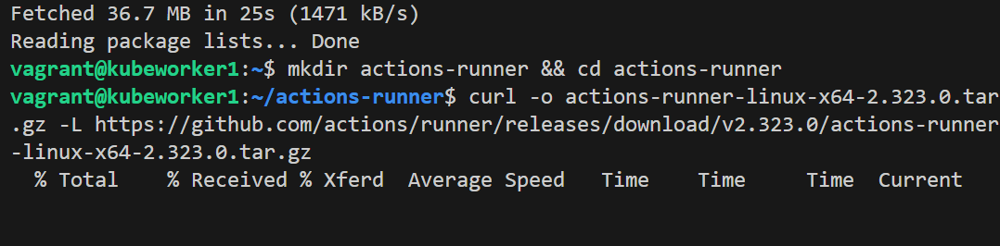
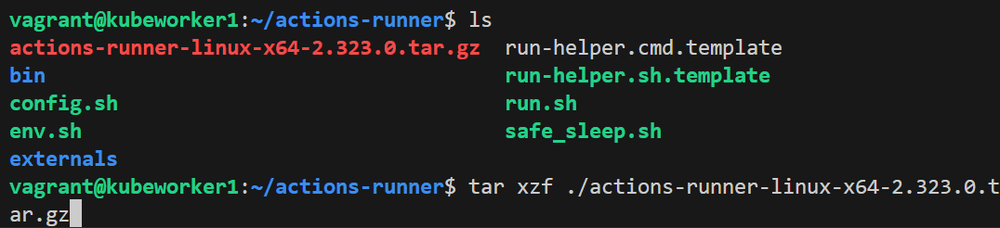
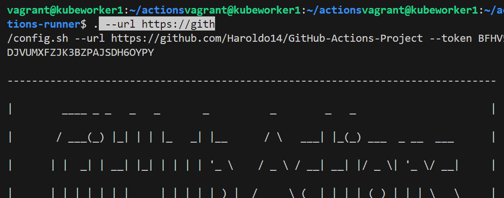
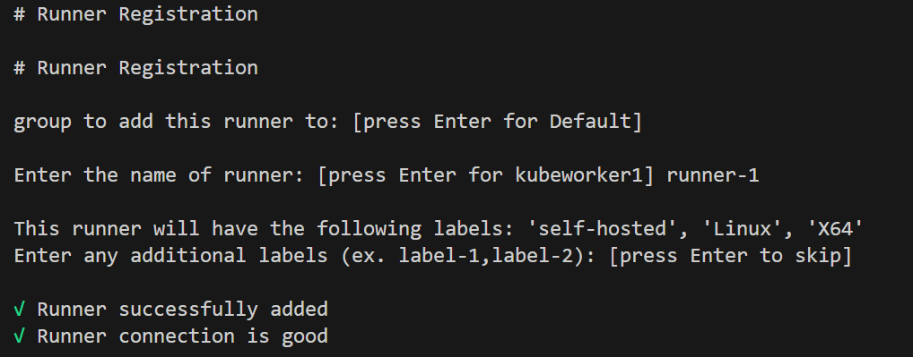
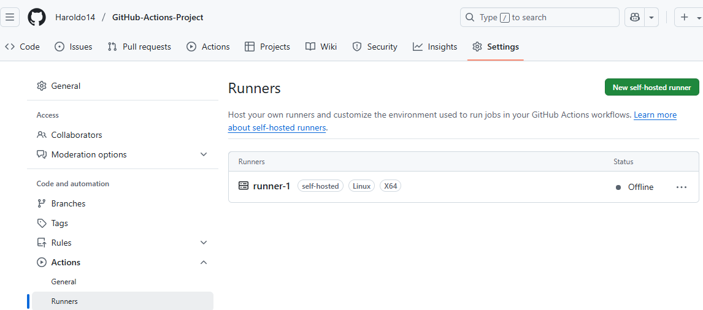
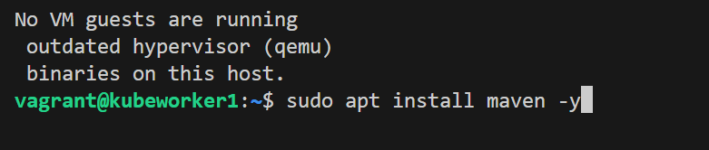
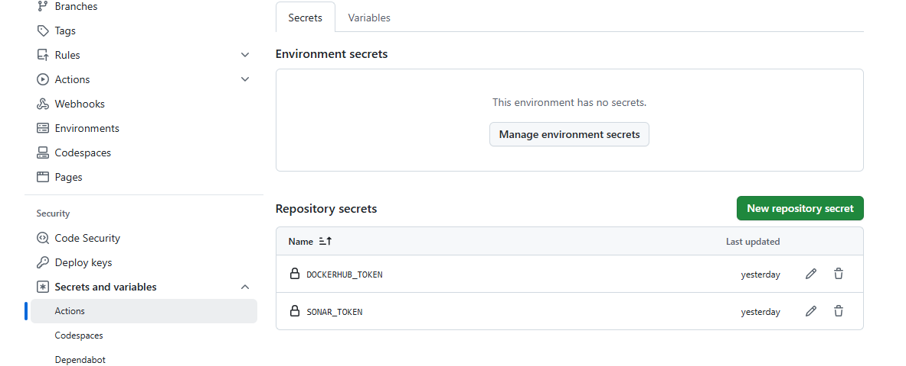
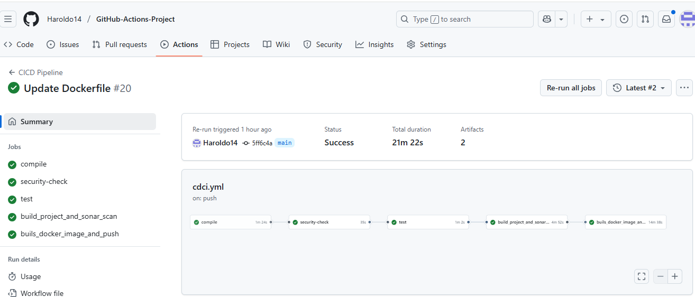

# CI/CD DevSecOps Pipeline avec GitHub Actions

## Technologies

- Java 17 (Temurin)
- Maven
- GitHub Actions
- Docker + Buildx
- Trivy
- Gitleaks
- SonarQube


# 📆 INSTALLATION.md — Mise en place du pipeline DevSecOps

Ce document décrit les étapes nécessaires pour reproduire ce projet.

## 1. Pré-requis

- Java 17
- Docker
- GitHub Actions Runner
- SonarQube
- Compte Docker Hub

## 2. Installer un GitHub Actions Runner (Linux)

```bash
git clone https://github.com/jaiswaladi246/Github-Actions-Project.git
```
### Deployer VM
```bash
vagrant init 
vagrant up
vagrant ssh kubeworker1
```
```bash
mkdir actions-runner && cd actions-runner
curl -o actions-runner-linux-x64-2.316.0.tar.gz -L https://github.com/actions/runner/releases/download/v2.316.0/actions-runner-linux-x64-2.316.0.tar.gz
tar xzf ./actions-runner-linux-x64-2.316.0.tar.gz
./config.sh --url https://github.com/<utilisateur>/<repo> --token <token>
sudo ./svc.sh install
sudo ./svc.sh start // sudo ./run.sh
```






Installer Maven
```bash
sudo apt install maven -y
```


## 3. Installation et Configuration Docker
```bash
sudo apt install docker.io
sudo systemctl start docker
sudo systemctl enable docker
sudo usermod -aG docker $(whoami)
newgrp docker
sudo systemctl restart docker
```

## 🔍 4. Variables & Secrets GitHub
Ajouter dans GitHub :

| Nom                  | Type    | Description                  |
|----------------------|---------|------------------------------|
| `DOCKERHUB_USERNAME` | Variable | Votre nom Docker Hub         |
| `DOCKERHUB_TOKEN`    | Secret   | Token Docker Hub             |
| `SONAR_TOKEN`        | Secret   | Token SonarQube              |
| `SONAR_HOST_URL`     | Variable | URL vers l'instance SonarQube|

Dans gitHub et le dossier Github-Actions-Project -> Settings -> Security -> Secrets and variables -> Actions 



## 5. Trivy & Gitleaks
Toutes ces etapes ont ete integres dans le pipeline de notre GitHub actions
```bash
# Trivy
sudo apt install wget gnupg lsb-release -y
wget -qO - https://aquasecurity.github.io/trivy-repo/deb/public.key | sudo apt-key add -
echo "deb https://aquasecurity.github.io/trivy-repo/deb $(lsb_release -sc) main" | sudo tee /etc/apt/sources.list.d/trivy.list
sudo apt update && sudo apt install trivy -y

# Gitleaks
VERSION=$(curl -s https://api.github.com/repos/gitleaks/gitleaks/releases/latest | grep tag_name | cut -d '"' -f 4)
curl -sSL -o gitleaks.tar.gz https://github.com/gitleaks/gitleaks/releases/download/${VERSION}/gitleaks_${VERSION#v}_linux_x64.tar.gz
tar -xzf gitleaks.tar.gz gitleaks
sudo mv gitleaks /usr/local/bin/
```

## 6. Lancer le pipeline
Un simple `git push` sur `main` ou un `commit change` déclenche le pipeline CI/CD complet.



## Exécution locale
Si tout a ete bien fait et couronnee de succes on peut utiliser cette image comme suit:
```bash
mvn clean package
docker build -t haroldo1414/gcbankapp:latest .
docker run -p 8080:8080 haroldo1414/gcbankapp:latest
```

La suite avec Terraform et AWS fera l'objet d'une mise a jour.